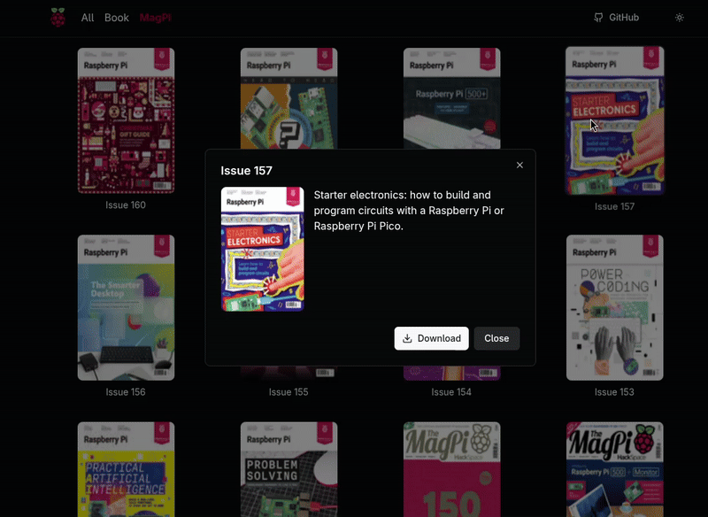

# Raspberry Bookshelf (Web Alternative)

**Raspberry Bookshelf** is a minimalist web-based catalog of Raspberry Pi Magazines and Books. Inspired by the official Raspberry Pi Desktop Bookshelf application ([raspberrypi-ui/bookshelf](https://github.com/raspberrypi-ui/bookshelf)), this project provides a simple and accessible web interface for browsing and downloading publications as PDF files.



## Features

- **Catalog:** Browse the official Raspberry Pi Magazines and Books collection.
- **Download PDFs:** Download magazines and books directly to your device.

## Getting Started

### Option 1: Run with Docker Compose

```bash
docker compose up
```
*This uses the provided `compose.yaml` file to set up and run the application.*

### Option 2: Build and Run the Binary from Source

If you have [Go](https://golang.org/dl/) installed:

```bash
make dependencies build
./raspberry-bookshelf
```
*This downloads dependencies, builds the binary, and runs the app.*

### Option 4: Download Pre-built Binaries

You can find ready-to-run binaries for various systems on the [releases page](https://github.com/brunofjesus/raspberry-bookshelf/releases).  
Just download the appropriate file for your OS and execute it.

---

## Usage

After running the application by one of the methods above, open your browser and navigate to:

```
http://localhost:8080
```

## License

This project is licensed under the GNU General Public License (GPL). See the [LICENSE](LICENSE) file for details.

*If you have suggestions or would like to contribute, feel free to open an issue!*
